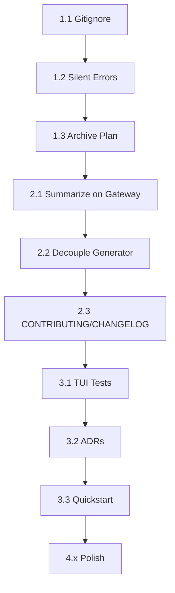

# SynthSpec Architecture Review — Action Plan

> **Source:** Architecture Review (2026-06-30) | Score: 8.0/10 → Target: 8.5+
> **Status:** Phase 1-2 Complete | Phase 3-4 Remaining

---

## Executive Summary

The codebase has made **significant progress** from 7.4 → 8.0. The remaining gaps are concentrated in:
1. **Generator ↔ State coupling** (Refactor #10) — highest architectural leverage
2. **Missing `Summarize()` on Gateway** (Refactor #9) — semantic clarity
3. **Thin TUI test coverage** (Refactor #11) — regression risk
4. **Housekeeping** (gitignore, binary, stale plan doc) — hygiene

---

## Priority 1 — Immediate (Low Effort, High Impact)

### 1.1 Add `synthspec/` and `*.exe` to `.gitignore` ✅ **VERIFIED DONE**
```bash
# Already in .gitignore:
synthspec/
synthspec.exe
*.exe
```
**Status:** Complete — verified in `.gitignore`

### 1.2 Fix Remaining Silent Error Suppressions

| File | Line | Current | Fix |
|------|------|---------|-----|
| `cmd/init.go` | 81 | `loadSettings, err := config.LoadSettings()` | ✅ Already logs warning |
| `cmd/resume.go` | 46 | `loadSettings, err := config.LoadSettings()` | ✅ Already logs warning |
| `cmd/root.go` | 33 | `s, err := config.LoadSettings()` | ✅ Already logs warning |
| `tui/dashboard/model.go` | 147 | `standards, err := config.LoadStandards()` | ✅ Already logs warning |
| `tui/dashboard/model.go` | 179 | `templates, err := config.LoadTemplates()` | ✅ Already logs warning |
| `tui/dashboard/handlers.go` | 80, 104, 200 | `if err := m.Session.Save(); err != nil` | ✅ Already checks error |

**Status:** All silent suppressions appear to be **already fixed** with proper error logging.

### 1.3 Archive/Retire `REFACTOR_PLAN.md`

**Action:** Move completed items to `CHANGELOG.md`, open remaining items as GitHub Issues, archive plan to `docs/development/refactor-history.md`.

**Steps:**
1. Create `CHANGELOG.md` at repo root with completed items
2. Create GitHub Issues for remaining items (#9, #10, #11, #12, #13, #14, #16, #17)
3. Move `REFACTOR_PLAN.md` → `docs/development/refactor-history.md`
4. Add link in `README.md` to refactor history

---

## Priority 2 — Short-Term (Medium Effort, High Architectural Value)

### 2.1 Add `Summarize()` to `Gateway` Interface (Refactor #9)

**Problem:** `state/pruner.go` abuses `QueryOracle()` to get summaries via `NextQuestion` field — semantic misuse.

**Files to Modify:**
- `gateway/gateway.go` — add interface method
- `gateway/gemini.go`, `openai.go`, `anthropic.go`, `openrouter.go` — implement
- `gateway/mock.go` — implement for tests
- `state/pruner.go` — call `gw.Summarize()` instead of `gw.QueryOracle()`

**Interface Addition:**
```go
// gateway/gateway.go
type Gateway interface {
    // ... existing methods ...
    
    // Summarize generates a concise summary of conversation history
    Summarize(ctx context.Context, history []Message) (string, error)
}
```

**Implementation Pattern (all providers):**
```go
func (g *GeminiGateway) Summarize(ctx context.Context, history []Message) (string, error) {
    // Build summarization prompt
    // Call LLM with summary-specific prompt
    // Return summary string
}
```

**Mock Implementation:**
```go
func (m *MockGateway) Summarize(ctx context.Context, history []Message) (string, error) {
    return "Mock summary of conversation history", nil
}
```

**Validation:** `go build ./... && go test ./state/...`

---

### 2.2 Decouple Generator from `*state.Session` (Refactor #10) — **HIGHEST LEVERAGE**

**Problem:** `fileGenerator.sess` is `*state.Session` (concrete), calls `sess.Save()` internally — couples synthesis to persistence.

**Current Coupling Points in `generator/generator.go`:**
- `fg.sess` field (line ~50)
- `fg.sess.Save()` calls in `generateSourceDocument`, `generateDownstreamParallel`, `runConsistencyVerification`
- `fg.sess.GeneratedFiles` mutations
- `fg.sess.Facts` reads/writes

**Solution:** Define `SessionPersistence` interface in `generator/`, inject it.

**New Interface (`generator/persistence.go`):**
```go
package generator

import "github.com/toanle/synthspec/domain"

// SessionPersistence abstracts session state persistence for the generator
type SessionPersistence interface {
    // SaveGeneratedFile persists a generated file's state
    SaveGeneratedFile(state GeneratedFileState) error
    
    // LoadGeneratedFile retrieves a generated file's state
    LoadGeneratedFile(fileName string) (GeneratedFileState, bool)
    
    // UpdateFacts updates the compiled facts
    UpdateFacts(facts domain.Facts) error
    
    // UpdateScores updates confidence scores
    UpdateScores(scores domain.ConfidenceScores, rationales domain.DimensionRationales) error
    
    // UpdateHistory appends to conversation history
    UpdateHistory(history []domain.Message) error
    
    // UpdateTokens increments token usage
    UpdateTokens(prompt, completion int) error
}

// GeneratedFileState mirrors state.GeneratedFileState but in generator package
type GeneratedFileState struct {
    FileName       string
    Results        []domain.ComplianceResult
    HasError       bool
    ErrMsg         string
    InProgressText string
    CurrentAttempt int
    PromptHash     string
    FactsHash      string
}
```

**Implementation in `state/session.go`:**
```go
// Session implements generator.SessionPersistence
func (s *Session) SaveGeneratedFile(state generator.GeneratedFileState) error {
    // Convert and save to s.GeneratedFiles
    return s.Save()
}

// ... implement other methods by mutating s and calling s.Save()
```

**Injection in `generator/generator.go`:**
```go
type fileGenerator struct {
    ctx            context.Context
    gw             gateway.Gateway
    persistence    SessionPersistence  // NEW: interface instead of *state.Session
    outputDir      string
    progress       chan<- string
    approvalChan   chan struct{}
    sourceFileName string
    sessionMu      sync.Mutex
}

func Generate(ctx context.Context, gw gateway.Gateway, persistence SessionPersistence, outputDir string, progress chan<- string, approvalChan chan struct{}) error {
    // ... create fileGenerator with persistence
}
```

**Call Sites to Update:**
- `cmd/init.go` — pass `sess` (which implements interface)
- `cmd/resume.go` — pass `sess`
- `generator/generator_test.go` — pass mock persistence

**Validation:** `go build ./... && go test ./generator/...`

---

### 2.3 Add `CONTRIBUTING.md` and `CHANGELOG.md`

**`CONTRIBUTING.md`** (at `docs/development/contributing.md`):
- Development setup (Go 1.26+, `go build`, `go test`)
- Code style (standard Go, `gofmt`, `golangci-lint`)
- Commit message format
- PR process
- Architecture principles (layering: domain → gateway → generator → tui)

**`CHANGELOG.md`** (at repo root):
```markdown
# Changelog

## [Unreleased]

## [2026-06-30] - Architecture Review Score 8.0
### Completed (from Refactor Plan)
- ✅ Extracted system prompts to `gateway/prompts.go`
- ✅ Moved `Standard` to `domain/`
- ✅ Removed `state → gateway` import
- ✅ Created `gateway/factory.go`
- ✅ Split `config/` into focused files
- ✅ Added `cmd/helpers.go` with `resolveProjectName`
- ✅ Established `docs/` structure
- ✅ Split TUI into `dashboard/` and `welcome/` sub-packages
```

---

## Priority 3 — Medium-Term (Test Coverage & Documentation)

### 3.1 Expand TUI State Machine Tests (Refactor #11)

**Current State:**
- `tui/dashboard/model_test.go` — 2.4KB (construction smoke tests)
- `tui/dashboard/update_test.go` — 1.4KB (minimal)

**Target Flows to Test:**
| Flow | Test Approach |
|------|---------------|
| Oracle result received → session state updated | Call `Update()` with `OracleResponseMsg`, assert `m.Session.Facts` updated |
| Generation started → `m.isGenerating = true` | Call `Update()` with `GenStartMsg`, assert state |
| Generation progress → `m.genStatus` updated | Call `Update()` with `GenProgressMsg`, assert status map |
| Generation completed → `m.isCompleted` | Call `Update()` with `GenCompleteMsg`, assert flag |
| Error handling → `m.errMsg` set | Call `Update()` with `ErrMsg`, assert error displayed |

**Test Pattern (Bubbletea idiom):**
```go
func TestDashboardModel_OracleResponse(t *testing.T) {
    sess := &state.Session{ProjectName: "test", Provider: "mock", Model: "mock"}
    gw := gateway.NewMockGateway()
    m := NewDashboardModel(sess, gw, "")
    
    // Simulate oracle response
    msg := OracleResponseMsg{Response: &gateway.OracleResponse{
        Facts: gateway.Facts{Functional: "test"},
        ConfidenceScores: gateway.ConfidenceScores{Functional: 50},
        NextQuestion: "Next?",
    }}
    
    m.Update(msg)
    
    if m.Session.Facts.Functional != "test" {
        t.Errorf("expected facts updated, got %q", m.Session.Facts.Functional)
    }
}
```

**Files:** `tui/dashboard/model_test.go`, `tui/dashboard/update_test.go`

---

### 3.2 Add Architecture Decision Records (ADRs)

**Location:** `docs/architecture/decisions/`

**Template (`000-template.md`):**
```markdown
# ADR-NNN: Title

## Status
Proposed | Accepted | Superseded

## Context
What problem are we solving?

## Decision
What did we decide?

## Consequences
- Positive:
- Negative:
- Neutral:
```

**Initial ADRs to Create:**
1. `001-layered-architecture.md` — domain → gateway → generator → tui
2. `002-gateway-interface.md` — multi-provider abstraction
3. `003-source-first-generation.md` — pipeline design
4. `004-tui-bubbletea-structure.md` — dashboard/welcome split

---

### 3.3 Local Dev Quickstart Doc

**Location:** `docs/development/quickstart.md`

**Content:**
```markdown
# Quickstart

## Prerequisites
- Go 1.26+
- API key for at least one provider (Gemini, OpenAI, Anthropic, OpenRouter)

## Build
```bash
go build -o synthspec.exe main.go
```

## Run
```bash
# Initialize new project
./synthspec.exe init my-project --provider gemini --api-key $GEMINI_KEY

# Resume existing
./synthspec.exe resume my-project

# List projects
./synthspec.exe list
```

## Test
```bash
go test ./...
go test ./generator/... -v
go test ./tui/dashboard/... -v
```

## Project Structure
[Link to architecture docs]
```
```

---

## Priority 4 — Polish (Low Priority)

### 4.1 Derive File List from Templates (Refactor #13)
- Remove hardcoded `synthesisFiles` in `tui/dashboard/views_standards.go`
- Derive from `config.LoadTemplates()`

### 4.2 Fix `ExportMetadata.Version` Hardcoding (Refactor #14)
- `generator/export/exporter.go:119` → use `generator.EngineVersion`

### 4.3 Remove Empty Directories (Refactor #15)
- `generator/compliance/` — delete
- `generator/synthspec/` — delete

### 4.4 Naming Fixes (Refactor #16)
| Location | Current | Proposed |
|----------|---------|----------|
| `generator/generator.go` | `TelemetryMetadata` | `GenerationMetadata` |
| `state/session.go` | `HasError bool + ErrorStr string` | `ErrMsg string` |
| `cmd/resume.go:72` | `"./output"` sentinel | Named constant |
| `cmd/export.go:102-108` | Manual bubble-sort | `sort.Slice` |
| `tui/welcome/model.go` | `IsNewProject` (exported) | Unexport if possible |

### 4.5 Evaluate `glamour` for Markdown (Refactor #17)
- Research compatibility with Bubbletea/Lipgloss
- Prototype replacement of `tui/shared/markdown.go` (275 lines)
- If compatible: replace; if not: add table-driven tests

---

## Execution Order & Dependencies



**Critical Path:** 2.1 → 2.2 (unlocks testability) → 3.1 (tests now viable)

---

## Validation Checklist Per Phase

### Phase 1 Complete When:
- [ ] `git status` shows no `synthspec.exe` or `synthspec/` tracked
- [ ] `grep -rn "_ = config.Load" cmd/ tui/` returns only error-handled calls
- [ ] `REFACTOR_PLAN.md` moved, `CHANGELOG.md` exists, GitHub Issues created

### Phase 2 Complete When:
- [ ] `go build ./...` passes with new `Summarize()` interface
- [ ] `go test ./state/...` passes (pruner uses `Summarize()`)
- [ ] `go build ./...` passes with `SessionPersistence` interface
- [ ] `go test ./generator/...` passes with mock persistence
- [ ] `CHANGELOG.md` and `CONTRIBUTING.md` committed

### Phase 3 Complete When:
- [ ] `go test ./tui/dashboard/... -v` shows >10 test cases covering state transitions
- [ ] `docs/architecture/decisions/` has ≥4 ADRs
- [ ] `docs/development/quickstart.md` exists and is accurate

---

## Risk Mitigation

| Risk | Mitigation |
|------|------------|
| Generator refactor breaks TUI integration | Keep `Generate()` signature compatible via adapter; test with `cmd/init.go` |
| `Summarize()` implementations diverge across providers | Use shared prompt constant in `gateway/prompts.go` |
| TUI tests flaky due to Bubbletea async | Test model state only, not rendering; use synchronous `Update()` calls |
| Empty dirs have hidden files | `ls -la generator/compliance/ generator/synthspec/` before delete |

---

## Estimated Effort

| Task | Effort | Risk |
|------|--------|------|
| 1.1-1.3 Housekeeping | 30 min | None |
| 2.1 `Summarize()` interface | 2-3 hrs | Low |
| 2.2 Generator decoupling | 4-6 hrs | Medium (touch points across cmd, generator, state) |
| 2.3 Docs | 1 hr | None |
| 3.1 TUI tests | 3-4 hrs | Low |
| 3.2 ADRs | 2 hrs | None |
| 3.3 Quickstart | 1 hr | None |
| 4.x Polish | 2-3 hrs | Low |

**Total:** ~15-20 hours to reach 8.5+

---

## Success Criteria for 8.5+

1. **Generator testable in isolation** — `generator_test.go` uses mock `SessionPersistence`, no temp dirs needed
2. **Semantic Gateway** — `Summarize()` exists, pruner uses it, no `NextQuestion` abuse
3. **TUI regression safety** — State machine transitions covered by tests
4. **Clean repo** — No binaries, no stale docs, clear contribution path
5. **Documented architecture** — ADRs capture key decisions for future maintainers