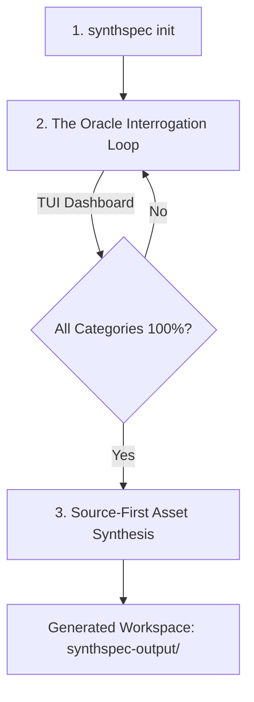

# SynthSpec

**SynthSpec** is a privacy-first, open-source command-line utility that transforms vague application ideas into production-ready, enterprise-grade engineering specifications.

Operating on a **Bring Your Own Key (BYOK)** paradigm, SynthSpec runs entirely on your local machine. It uses advanced LLM reasoning to systematically cross-examine you on requirements, identify missing edge cases, map out architectural dependencies, and synthesize a structured suite of markdown documents and machine-readable development assets.

---

## Core Persona: The SynthSpec Solution Architect

At the heart of SynthSpec is **"The Architect"** — an expert AI Solution Architect persona that guides you from vague ideas to production-ready engineering specifications. Displayed prominently across the TUI interface, The Architect:

- **Interrogates** — Asks precise, single-question cross-examinations to surface hidden requirements, edge cases, and architectural dependencies (labeled **`Architect's Question:`** in the dashboard chat).
- **Recommends** — When you respond with `Ctrl+K` ("I don't know"), The Architect leverages industry best practices to suggest optimal architectural, compliance, or security choices on your behalf.
- **Synthesizes** — Transforms validated requirements into a structured suite of 7 specification documents using a source-first, parallel-generation pipeline.
- **Audits** — Evaluates every generated document against 20+ engineering quality standards (clean architecture, SQL parameterization, STRIDE threat modeling, etc.) and iteratively refines until passing.
- **Verifies** — Performs cross-document consistency checks to ensure logical coherence across all deliverables, flagging contradictions for automatic correction.

> 💡 **The Architect operates under a strict Single Question Constraint** — it asks one question at a time to prevent cognitive overload and maintain focused, productive conversations throughout the interrogation loop.

---

## Core Workflows



### 1. Initialization
Start a new project spec-building session locally:
```bash
synthspec init <project_name>
```
This sets up an isolated directory configuration under `.synthspec/` containing state preservation files. If your session is interrupted, resume it anytime with:
```bash
synthspec resume <project_name>
```

### 2. The Interactive Interrogation Loop (The Oracle)
The CLI launches an interactive terminal dashboard. The AI agent acts as "The Oracle" under a **Single Question Constraint** (it will only ask one question at a time to prevent cognitive overload). 

It tracks four categorical vectors:
- **Functional**: Features, user stories, workflows.
- **Structural**: Component boundaries, protocols, data schemas.
- **Security**: Cryptography requirements, key isolation.
- **Compliance**: Threat vectors, SOC2/HIPAA mappings.

The generation phase remains locked behind a compliance gate until all confidence meters reach **100%**.

*💡 Pro-Tip: Type `:edit` inside the input box at any time to open the session state directly in your system default editor ($EDITOR).*

### 3. Spec Approval and Asset Generation (The Draftsman)
Once all vectors hit 100% confidence, the asset synthesis engine unlocks. It generates `01_domain_model_use_cases.md` first, then fans out the remaining documents in parallel using the locked source doc as the reference baseline:
- **`00_compliance_report.md`**: Summarized standards evaluation report.
- **`.synthspec-meta.json`**: Session statistics and engine metadata.
- **`01_domain_model_use_cases.md`**: Domain source of truth and scenario foundation.
- **`02_prd_functional.md`**: Formal Product Requirements Document.
- **`03_system_architecture.md`**: Decoupled component design & schema layout.
- **`04_api_architecture_integration.md`**: API integration contract and transport rules.
- **`05_coding_standards_guidelines.md`**: Development standards and CI/CD guidance.
- **`06_security_threat_model.md`**: Comprehensive STRIDE threat modeling & mitigations.
- **`07_engineering_roadmap.md`**: Delivery phases and timeline planning.
- **`08_behavioral_specifications.feature`**: Executable Cucumber/Gherkin BDD specifications.

---

## Updates & Advanced Commands

### 1. `synthspec update`
Modify or add new requirements to an existing project specification by booting directly into the update panel:
```bash
synthspec update <project_name>
```

### 2. Session Diffs & Approval Gate
Before modifying any physical markdown specification files on disk, SynthSpec calculates a line-by-line diff.
- Displays a colorblind-safe Git-style diff viewer in the TUI using explicit `+` / `-` symbols.
- Press `Tab` / `Shift+Tab` to navigate changes across multiple files.
- Press `a` or `Enter` to approve and save changes to disk, or `Esc` / `q` to reject and cancel.

### 3. TUI Command Escapes
While in the interactive interrogation loop console, type the following commands into the text input box:
- **`:undo`**: Reverts the last requirements submission and rolls back the session state using the internal session time-travel stack.
- **`:override`** or **`:bypass`**: Forcibly overrides confidence meters to 100% and immediately compiles downstream specification assets (useful to bypass pedantic LLM sub-queries).
- **`:edit`**: Suspends the TUI and opens the transient facts session context directly in your host system's `$EDITOR`.

---

## Quick Start & Installation

### Build & Run from Source
Ensure you have Go 1.20+ installed.

#### Option A: Run directly (Development)
You can run the application directly using the recommended OpenRouter and DeepSeek configuration (make sure `OPENROUTER_API_KEY` is set):
```bash
# Run with recommended OpenRouter DeepSeek model
go run main.go init test-project --provider openrouter --model deepseek-v4-flash

# Run with the offline mock provider (no API key needed)
go run main.go init test-project --mock
```

#### Option B: Compile & Build Binary
If you prefer compiling to a binary:
```bash
# Clone the repository
git clone https://github.com/toanle/synthspec.git
cd synthspec

# Build the binary
go build -o synthspec main.go
```
To set a specific version at build time, compile using `-ldflags`:
```bash
go build -ldflags="-X 'github.com/toanle/synthspec/generator.EngineVersion=1.0.0'" -o synthspec main.go
```

### Setup API Keys
Setup your chosen upstream LLM provider API key:

**On Linux / macOS (Bash):**
```bash
# Gemini
export GEMINI_API_KEY="your-gemini-key"

# OpenAI
export OPENAI_API_KEY="your-openai-key"

# Anthropic
export ANTHROPIC_API_KEY="your-anthropic-key"

# OpenRouter
export OPENROUTER_API_KEY="your-openrouter-key"
```

**On Windows (PowerShell):**
```powershell
# Gemini
$env:GEMINI_API_KEY="your-gemini-key"

# OpenAI
$env:OPENAI_API_KEY="your-openai-key"

# Anthropic
$env:ANTHROPIC_API_KEY="your-anthropic-key"

# OpenRouter
$env:OPENROUTER_API_KEY="your-openrouter-key"
```

### Run with Live LLM Provider (Default)
To run with a live upstream model, make sure you have set the appropriate API key environment variables (as detailed in the "Setup API Keys" section above), then initialize or resume the session.

For example, to run with **OpenRouter** and **DeepSeek-v4-Flash** (highly recommended):

**On Linux / macOS:**
```bash
./synthspec init test-project --provider openrouter --model deepseek-v4-flash
./synthspec resume test-project --provider openrouter --model deepseek-v4-flash
```

**On Windows Command Prompt (CMD):**
```cmd
synthspec init test-project --provider openrouter --model deepseek-v4-flash
synthspec resume test-project --provider openrouter --model deepseek-v4-flash
```

**On Windows PowerShell:**
```powershell
.\synthspec init test-project --provider openrouter --model deepseek-v4-flash
.\synthspec resume test-project --provider openrouter --model deepseek-v4-flash
```

### Run with Mock Provider (Local Offline Testing)
To run and evaluate the interactive TUI flow offline without requiring a live LLM API key, initialize or resume the session using the `--mock` flag. Mock generation also follows the same source-first, fresh-prompt retry flow:

**On Linux / macOS:**
```bash
./synthspec init test-project --mock
./synthspec resume test-project --mock
```

**On Windows Command Prompt (CMD):**
```cmd
synthspec init test-project --mock
synthspec resume test-project --mock
```

**On Windows PowerShell:**
```powershell
.\synthspec init test-project --mock
.\synthspec resume test-project --mock
```

---

## Documentation & License

For developers, contributors, and maintainers:
- **[Documentation Overview](docs/README.md)**: Full directory map and document overview.
- **[System Architecture](docs/architecture/system.md)**: Decoupled component layouts and diagrams.
- **[TUI Design Standards](docs/standard/tui-design.md)**: Grid spacing and terminal visual guides.
- **[Project Roadmap](docs/ROADMAP.md)**: Milestones, priorities, and status checklist.
- **[Contributing Guide](CONTRIBUTING.md)**: Guidelines for contributing code, architecture rules, and testing standards.
- **[License (MIT)](LICENSE)**: SynthSpec open-source license information.
