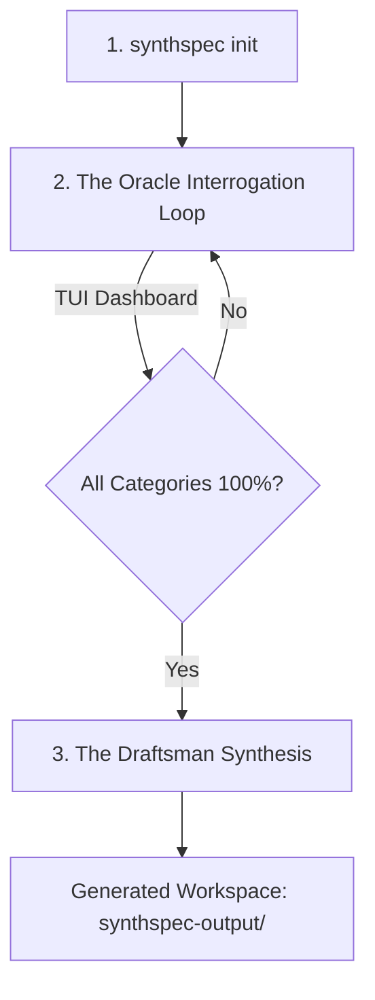

# SynthSpec

**SynthSpec** is a privacy-first, open-source command-line utility that transforms vague application ideas into production-ready, enterprise-grade engineering specifications.

Operating on a **Bring Your Own Key (BYOK)** paradigm, SynthSpec runs entirely on your local machine. It uses advanced LLM reasoning to systematically cross-examine you on requirements, identify missing edge cases, map out architectural dependencies, and synthesize a structured suite of markdown documents and machine-readable development assets.

---

## Core Workflows



### 1. Initialization
Start a new project spec-building session locally:
```bash
synthspec init <project_name>
```
This sets up an isolated directory configuration under `.synthspec/` containing state preservation files. If your session is interrupted, resume it anytime with:
```bash
synthspec resume
```

### 2. The Interactive Interrogation Loop (The Oracle)
The CLI launches an interactive terminal dashboard. The AI agent acts as "The Oracle" under a **Single Question Constraint** (it will only ask one question at a time to prevent cognitive overload). 

It tracks four categorical vectors:
- **Functional**: Features, user stories, workflows.
- **Structural**: Component boundaries, protocols, data schemas.
- **Security**: Cryptography requirements, key isolation.
- **Compliance**: Threat vectors, SOC2/HIPAA mappings.

The generation phase remains locked behind a compliance gate until all confidence meters reach **100%**.

*💡 Pro-Tip: Type `:edit` inside the input box at any time to open the session state directly in your system default editor ($EDITOR).*

### 3. Spec Approval and Asset Generation (The Draftsman)
Once all vectors hit 100% confidence, the "Draftsman" engine unlocks to synthesize standard engineering deliverables:
- **`.synthspec-meta.json`**: Session statistics and engine metadata.
- **`01_prd_functional.md`**: Formal Product Requirements Document.
- **`02_system_architecture.md`**: Decoupled component design & schema layout.
- **`03_security_threat_model.md`**: Comprehensive STRIDE threat modeling & mitigations.
- **`04_openapi_contract.yaml`**: Synthesized REST/gRPC API definitions.
- **`05_engineering_backlog.json`**: Tasks structured as Epics & User Stories for Jira/GitHub ingestion.

---

## Quick Start & Installation

### Build from Source
Ensure you have Go 1.20+ installed:
```bash
git clone https://github.com/your-org/synthspec.git
cd synthspec
go build -o synthspec main.go
```

### Setup API Keys
Setup your chosen upstream LLM provider API key:

**On Linux / macOS (Bash):**
```bash
# Gemini
export GEMINI_API_KEY="your-gemini-key"

# OpenAI
export OPENAI_API_KEY="your-openai-key"

# Anthropic
export ANTHROPIC_API_KEY="your-anthropic-key"

# OpenRouter
export OPENROUTER_API_KEY="your-openrouter-key"
```

**On Windows (PowerShell):**
```powershell
# Gemini
$env:GEMINI_API_KEY="your-gemini-key"

# OpenAI
$env:OPENAI_API_KEY="your-openai-key"

# Anthropic
$env:ANTHROPIC_API_KEY="your-anthropic-key"

# OpenRouter
$env:OPENROUTER_API_KEY="your-openrouter-key"
```

### Run with Live LLM Provider (Default)
To run with a live upstream model, make sure you have set the appropriate API key environment variables (as detailed in the "Setup API Keys" section above), then initialize or resume the session without the `--mock` flag:

**On Linux / macOS:**
```bash
./synthspec init test-project
./synthspec resume test-project
```

**On Windows Command Prompt (CMD):**
```cmd
synthspec init test-project
synthspec resume test-project
```

**On Windows PowerShell:**
```powershell
.\synthspec init test-project
.\synthspec resume test-project
```

You can optionally override the default provider or model by passing the `--provider` or `--model` flags:
```bash
# E.g., using Gemini explicitly
./synthspec init test-project --provider gemini --model gemini-2.5-pro
```

### Run with Mock Provider (Local Offline Testing)
To run and evaluate the interactive TUI flow offline without requiring a live LLM API key, initialize or resume the session using the `--mock` flag:

**On Linux / macOS:**
```bash
./synthspec init test-project --mock
./synthspec resume test-project --mock
```

**On Windows Command Prompt (CMD):**
```cmd
synthspec init test-project --mock
synthspec resume test-project --mock
```

**On Windows PowerShell:**
```powershell
.\synthspec init test-project --mock
.\synthspec resume test-project --mock
```

---

## Documentation

For developers, contributors, and maintainers, check out the detailed documentation directory:
- **[Documentation Overview](docs/README.md)**: Entry point and directory map.
- **[System Architecture](docs/architecture/system.md)**: Decoupled component layouts and diagrams.
- **[TUI Design Standards](docs/standard/tui-design.md)**: Grid spacing and terminal visual guides.
- **[Project Roadmap](docs/ROADMAP.md)**: Milestones, priorities, and status checklist.
