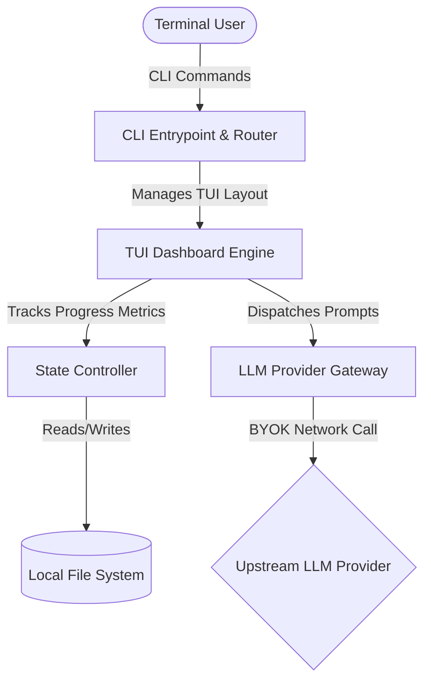

# Enterprise Specification Suite: SynthSpec

**Version**: 1.0.0  
**Target**: Open-Source BYOK AI Solution Architect CLI  

---

## 01. Product Requirements Document (PRD)

### Product Vision
SynthSpec is a privacy-first, open-source command-line utility that transforms vague application ideas into production-ready, enterprise-grade engineering specifications. Operating on a "Bring Your Own Key" (BYOK) paradigm, the tool executes locally, utilizing advanced LLM reasoning to systematically cross-examine users, identify missing edge cases, map out architectural dependencies, and output structured markdown and machine-readable development assets.

### Core Workflows

#### 1. Initialization and Authentication
The application must support secure execution via locally defined environment variables (`GEMINI_API_KEY`, `OPENAI_API_KEY`, or `ANTHROPIC_API_KEY`).

Running `synthspec init <project_name>` sets up an isolated directory configuration under `./synthspec/<project_name>/` containing state preservation files.

#### 2. The Interactive Interrogation Loop (The Oracle)
The system shifts into an interactive TUI (Terminal User Interface).

The AI agent functions under a strict "Single Question Constraint"—it is prohibited from dumping multiple distinct questions in a single conversational turn.

The AI evaluates user input against four internal specification dimensions: Functional, Structural, Security, and Compliance.

A localized state scoring algorithm calculates a real-time completion confidence percentage (0% to 100%).

#### 3. Spec Approval and Asset Generation (The Draftsman)
The generation phase remains locked behind a strict compliance gate until all tracked confidence vectors hit 100%.

Upon hitting full confidence, the interface exposes an action prompt allowing the user to inspect the state, manually adjust raw parameters in an editor (e.g., VS Code, Vim), or trigger final artifact synthesis.

### Functional Requirements Matrix

| ID | Feature Name | Description | Acceptance Criteria |
| :--- | :--- | :--- | :--- |
| **FR-101** | Multi-Model Routing | Dynamically interface with different upstream LLMs via uniform configurations. | System switches between Gemini, OpenAI, and Anthropic providers without code modification using an abstracted gateway layer. |
| **FR-102** | State Persistence | Save conversational progress natively to protect against accidental session drops. | Creates a local `.synthspec/session.json` file on every turn; running `synthspec resume` fully reinstates the TUI state. |
| **FR-103** | Interactive TUI | Provide visual feedback indicators instead of standard linear scrolling logs. | Render distinct interface zones for the current question panel, user prompt input field, and live categorical completion meters. |
| **FR-104** | Direct Editor Link | Allow users to quickly alter raw requirements text mid-session. | Typing `:edit` forks a subprocess opening the system default text editor (`$EDITOR`) to modify the compiled context JSON. |

### Non-Functional Requirements

#### Performance & Token Optimization
- **Context Pruning**: The CLI must track conversation history tokens. Before hitting 75% of the target LLM model’s context limit, the system must trigger a background summarization cycle, condensing answered requirements while preserving engineering facts.
- **Latency Indicators**: Because deep architectural reasoning requires extended LLM execution times, the TUI must display a dynamic, non-blocking loading spinner to confirm system responsiveness during API round-trips.

#### Portability
The CLI must build into a single executable binary or compile cleanly via lightweight runtime packages across Linux, macOS, and Windows.

---

## 02. System Architecture & Component Design

SynthSpec is architected as an event-driven, decoupled CLI system leveraging local state execution. It requires no central web backend or telemetry collection engines.



### Component Breakdown

#### 1. CLI Entrypoint & Router
Responsible for processing root arguments, flags, and system commands. It reads execution contexts and overrides application runtime settings based on environment variables.

#### 2. TUI Dashboard Engine
Built using an asynchronous terminal framework. It controls terminal display state, isolates standard output streams from system errors, renders layout regions, and intercepts keyboard event loops.

#### 3. State Controller
Maintains runtime synchronization. It tracks the dynamic conversation history matrix, evaluates completion scores, and serializes transient application states back to the local file system.

#### 4. LLM Provider Gateway
An abstraction interface converting unified application schemas into vendor-specific payload calls (e.g., streaming structures, tools, system instructions, and temperature overrides).

---

## 03. Security, Privacy & Threat Model

### Privacy Guarantees
- **Zero-Data Retention Policy**: Under no circumstances may user instructions, keys, or synthesized specifications be transmitted to an external service other than the explicit endpoints maintained by the user's chosen API provider.
- **Key Isolation**: API tokens are held entirely within volatile application memory space. The system must never write keys to log outputs, state caches, or error diagnostics files.

### STRIDE Threat Modeling Analysis

| Threat Category | Identified Vulnerability | System Mitigation Strategy |
| :--- | :--- | :--- |
| **Spoofing** | Untrusted third-party binaries imitating SynthSpec to steal local API tokens. | Maintain strict cryptographic signing chains on release packages; provide clear SHA-256 validation sums across distribution channels. |
| **Tampering** | Malicious injection of local configurations altering core system prompt bounds. | Validate configuration file structures against rigorous rigid schemas on boot; ignore inputs violating datatype definitions. |
| **Repudiation** | Inability to debug token exhaustion or billing variance occurrences on user keys. | Log raw payload token usage stats locally to a private user-facing file (`./synthspec/usage.log`) for client verification. |
| **Information Disclosure** | Leakage of proprietary product architecture concepts through unencrypted system logs. | Enforce zero-logging principles for user-supplied input content across standard system error dumps. |
| **Denial of Service** | Upstream API rate throttling blocking completion of the architecture loop. | Embed automated exponential backoff retry algorithms into the API gateway wrapper handling 429 error states cleanly. |
| **Elevation of Privilege** | User input manipulating system commands via indirect prompt injection vectors. | Structure downstream prompt frames utilizing explicit system role blocks and separate user data arrays instead of concatenated text fields. |

---

## 04. Data Schema & File Output Deliverables

Upon completion of the integration loop, SynthSpec generates a clean, standardized workspace structure containing human-readable markdown documentation alongside machine-parsable execution files.

### Output Workspace Structure
```plaintext
synthspec-output/
├── .synthspec-meta.json
├── 01_prd_functional.md
├── 02_system_architecture.md
├── 03_security_threat_model.md
├── 04_openapi_contract.yaml
└── 05_engineering_backlog.json
```

### Component Schemas

#### Metadata Schema (`.synthspec-meta.json`)
Tracks internal execution details, project definitions, and foundational verification data.

```json
{
  "$schema": "http://json-schema.org/draft-07/schema#",
  "title": "SynthSpecMetadata",
  "type": "object",
  "properties": {
    "project_name": { "type": "string" },
    "generation_timestamp": { "type": "string", "format": "date-time" },
    "engine_version": { "type": "string" },
    "provider_used": { "type": "string" },
    "completion_metrics": {
      "type": "object",
      "properties": {
        "total_turns": { "type": "integer" },
        "tokens_consumed": { "type": "integer" }
      },
      "required": ["total_turns", "tokens_consumed"]
    }
  },
  "required": ["project_name", "generation_timestamp", "engine_version", "provider_used", "completion_metrics"]
}
```

#### Engineering Backlog Schema (`05_engineering_backlog.json`)
Structures functional units into a clean task schema suitable for direct script-based ingestion into tools like Jira, Linear, or GitHub issues.

```json
{
  "$schema": "http://json-schema.org/draft-07/schema#",
  "title": "EngineeringBacklog",
  "type": "object",
  "properties": {
    "epics": {
      "type": "array",
      "items": {
        "type": "object",
        "properties": {
          "id": { "type": "string" },
          "title": { "type": "string" },
          "description": { "type": "string" },
          "tasks": {
            "type": "array",
            "items": {
              "type": "object",
              "properties": {
                "id": { "type": "string" },
                "summary": { "type": "string" },
                "details": { "type": "string" },
                "acceptance_criteria": {
                  "type": "array",
                  "items": { "type": "string" }
                }
              },
              "required": ["id", "summary", "details", "acceptance_criteria"]
            }
          }
        },
        "required": ["id", "title", "description", "tasks"]
      }
    }
  },
  "required": ["epics"]
}
```
