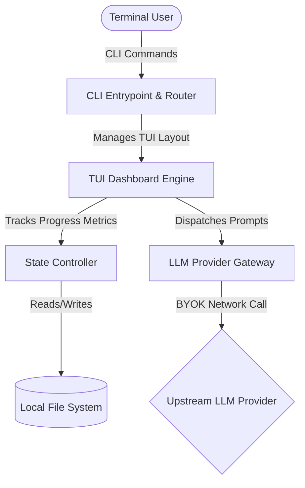

# System Architecture & Component Design

SynthSpec is architected as an event-driven, decoupled CLI system leveraging local state execution. It requires no central web backend, server infrastructure, or telemetry collection engines.

## Architecture Overview

## Component Breakdown

### 1. The Architect Persona (User-Facing AI Role)
The Architect is the expert AI Solution Engineer persona that users interact with throughout the TUI. While not a discrete software component, The Architect is the personification of the system's intelligence — the combination of:

- **LLM System Prompts**: Every gateway provider sends the instruction *"You are SynthSpec, an expert AI Solution Architect."* to establish the persona.
- **The Oracle Interrogation Loop**: The Architect asks questions labeled `Architect's Question:` in the TUI chat panel.
- **The Draftsman Synthesis Engine**: The Architect generates and audits specification documents.
- **Recommendation Engine**: The Architect suggests optimal choices when the user invokes "I don't know" (`Ctrl+K`).

The Architect persona is consistently maintained across all phases (interrogation, generation, auditing) to provide a unified user experience.

### 2. CLI Entrypoint & Router
Responsible for processing root arguments, flags, and system commands. It reads execution contexts and overrides application runtime settings based on environment variables.

Key responsibilities:
- Parse flags and commands (`init`, `resume`, etc.).
- Bootstrap environment configuration (e.g., parsing API keys).
- Route control flow to either the TUI dashboard engine or the batch generator.

The batch generator now runs the domain source document first, then fans out the downstream documents in parallel using that locked source doc as the shared reference baseline.

### 2. State Controller
Maintains runtime synchronization. It tracks the dynamic conversation history matrix, evaluates completion scores across four dimensions (Functional, Structural, Security, Compliance), and serializes transient application states back to the local file system.

Key responsibilities:
- Maintain session state in memory.
- Serialize and deserialize state to/from a local `.synthspec/session.json` file.
- Track score calculation logic for progress metrics.

For details on the TUI Dashboard Engine, see [TUI Architecture](tui.md).
For details on the LLM Provider Gateway, see [LLM Provider Gateway Architecture](gateway.md).
